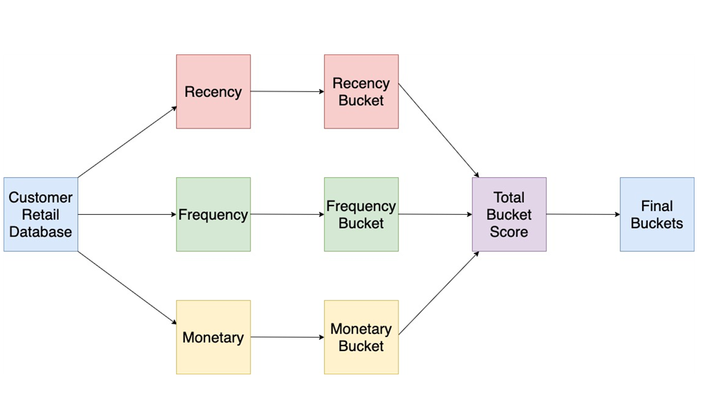

# online_retail

## RFM - ONLINE RETAIL ANALYSIS:

Online Retail Database is an open source database. You can download it from the link below.
https://bit.ly/2Y1kJsk 
I wrote all the queries at PostgreSQL. 
 
### Our purposes to do this project; 
-To define recency, frequency and monetary values. 

-To find customers' distribution by these variables. 

-To show customers’ behaviors 

You can peruse my Tableau account to see all dashboards about RFM Onlne Retail Analysis.

My Tableau Public Account: https://public.tableau.com/profile/elif.karakutuk#!/
                           https://tabsoft.co/322rtZL
                           
                           
## MARKET BASKET - ONLINE RETAIL ANALYSIS:

### Our purposes to do this project; 
-To define two different products in the same basket.

-To find the top 50  and 5 products in the same basket

You can peruse my Tableau account to see all dashboards about RFM Onlne Retail Analysis.

My Tableau Public Account: https://public.tableau.com/profile/elif.karakutuk#!/
                           https://tabsoft.co/31XA2EP

